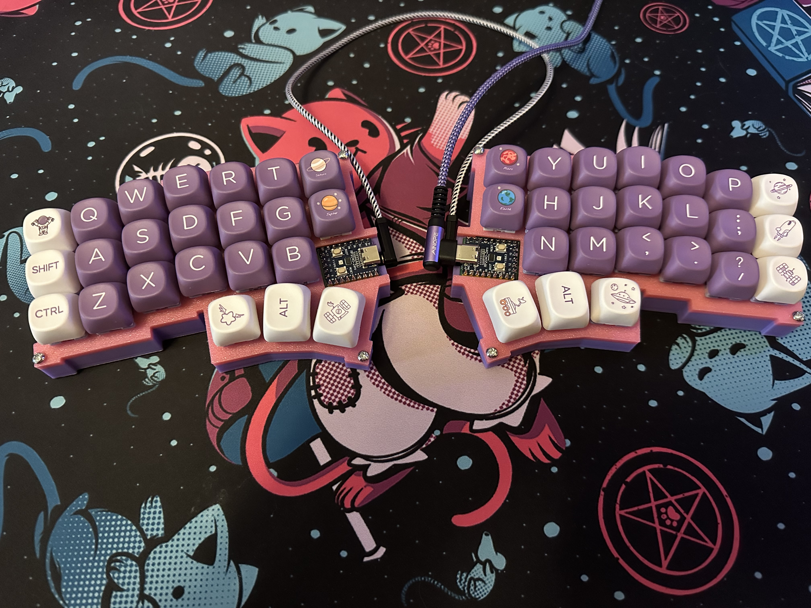
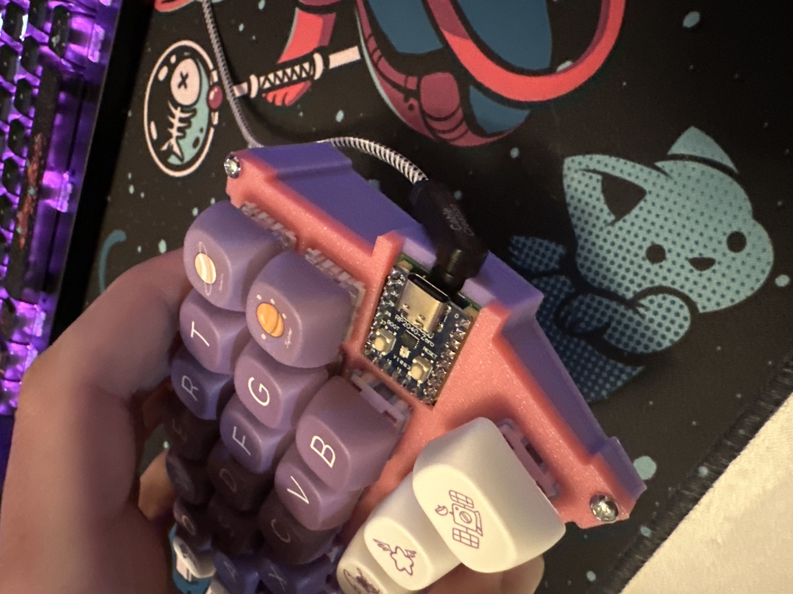

<h1 align="center">
travyboard
</h1>

## A corne style keyboard with the Pico SDK and TinyUSB

A personal project demonstrating how to build a keyboard using the
Raspberry Pi Pico microcontroller in c++. Intent on expanding to create more powerful
keyboards with more features (wireless coming soon).

### Photos
<div style="display: flex; justify-content: space-around;">
  
  
</div>

### Features

- 3d printed case
- 3x6 matrix with 3 button thumb clusters and 2 mode keys
- Split one way communication
- Full keymap controlled by the master pico
- Dynamic layers
- ws2812 rgb leds on every key

### Requirements for building

- Two Raspberry Pi Picos. I have the waveshare zeroes on the actual PCB.
- Cmake and gcc/g++ installed. May want to set up wsl2 on Windows.

### Setup

1. Clone this repository:

```sh
git clone https://github.com/travmonkey/travyboard.git
cd travyboard
```

2. Update the submodules:

```sh
# Includes the pico-sdk and rf modules
git submodule update --init --recursive
```

3. To build the project you need gcc-arm-none-eabi, cmake, and make installed:

```sh
cd firmware
mkdir build && cd build
cmake -DCMAKE_EXPORT_COMPILE_COMMANDS=ON ..
make
```

5. Mount and flash both picos with the master and slave compiled .uf2 code.
```sh
mkdir ~/rpi-pico
sudo fdisk -l # Find the pico device
sudo mount /dev/sdx1 /home/`<user>`/rpi-pico
sudo cp src/devices/right_half/right_half.uf2 /home/`<user>`/rpi-pico/
sudo cp src/devices/left_half/left_half.uf2 /home/`<user>`/rpi-pico/
```

Alternativly you can modify the script I wrote to include your own directories and username
